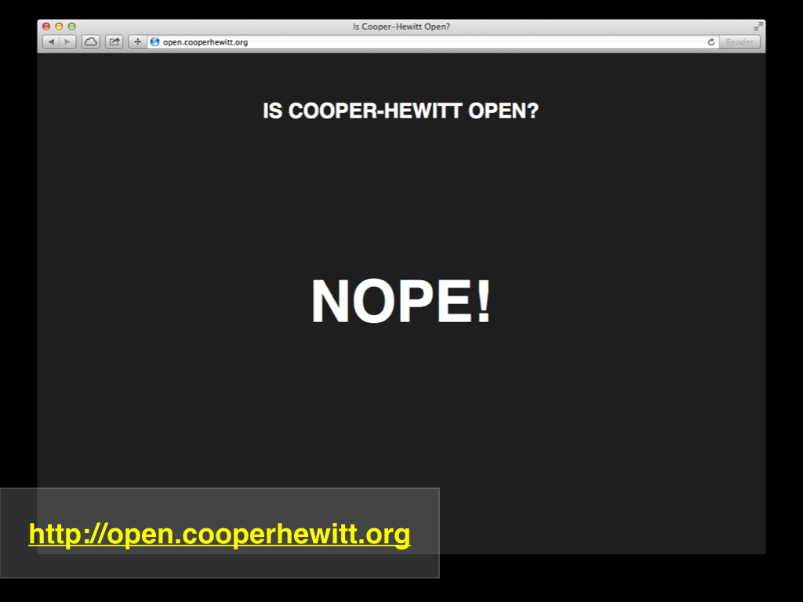

Hi Everyone -- I'm Micah Walter, and I'm really glad to be here. I'm part of the Digital & Emerging Media team at the Smithsonian's Cooper-Hewitt, National Design Museum, in New York. 

This place!

We've been closed for almost as long as I've worked there. About two years now I think, and we plan to reopen in about a year's time. 
For those of you who don't know, we are part of the larger Smithsonian Institution which is mainly in Washington DC, and we are housed in this mansion you see here, which used to belong to this guy named Andrew Carnegie. He lived here back in the early 1900's, until he died.

It's a big house, and for the last two years we have been hard at work renovating it with q-tips and kim-wipes. It's going to be really nice when it re-opens. There will be a new stairwell... Something like 60% more gallery space, and we plan to make it a much more interactive and immersive experience for our visitors.

So, we're closed. This is actually one of the first little things I wrote when we released our API about a year and a half ago. Yes, there is actually an API method that just lets you know if we are open or closed. It's in fact one of our most frequently asked questions.

But, this is what we are starting to talk about. Little experiments, and building things quickly, and being nimble and what-not.

About this time last year, Aaron Cope and I were at MCN talking about our new collection's website, the Alpha... It had an API already, which did a few things here and there, nothing major. But the point here is, we built a framework for building other things. 
We created an environment which could allow us a way of thinking about what it was we actually wanted to do, and it gave us, if anything, a way of talking about things.

I'm the "webmaster" at the museum. At least in title. I've been webmastering that museum for about three and a half years now. 
But, putting things on our website is only a small part of my job. Within my team, one of the things I take part in which is kind of hard to put into words is I sort of test the API, and the other systems we are working on. I sort of do this by building little things, and working through ideas and making working prototypes.

So, I've really been wanting to come here and talk about what all of this means. How we work as a team, and how I personally work as an individual. The talk is called Rapid Prototyping, but I think thats just fancy talk for building stuff. This talk is really about how to create an environment where you can take a spark of an idea and turn it into something real, and then what...

So lets start by talking about the API. We kind of knew we'd need an API at some point. It's an interface to all of our stuff. We have a list of publicly available methods, and yes, we have a bunch of private methods, that we use for our own needs. 
In the future, we imagine, Cooper-Hewitt will be one of the largest consumers of its own API. That's about all I can say about that right now, but I think you get the idea. We are building an interface we can use for a lot of different things. 

The API is pretty straightforward. We use pretty standard technologies that are abundant these days. We use Oauth2 for authentication, because it's something people have gotten used to. The whole thing is written as a component of our larger collection's website, which means it uses PHP and MySQL and Apache and well, thats basically it. 

Our API is still a work in progress. We've spent a good amount of time structuring it, and developing ideas around how to authenticate users for different aspects of the API. This is all still in flux as you might imagine, but the basics are there. If I'm working on something new and I realize a need for an API method that isn't there, its typically pretty easy to add one. And that's kind of the important point. We own our own API. We wrote it ourselves and we have control over it. We can turn it off if we need to, and we can rate limit users if we need to. We consider that to be a good problem to have. But more importantly, we can customize it at will. Nothing is really set in stone, and we make that pretty clear in its documentation.

When we first launched the API I was really interested in working with it. I wanted to learn how I could use it, what a developer like myself might use it for. I built that little "Is Cooper-Hewitt Open" project just as a way to see if I could get authenticated and make an API call. 

But here is where we start talking about prototyping. I like to think in parallel tracts. I think thats a really important point. It's my working method. I tend to work on multiple things at a time, and often times, without even realizing it at first, these things converge. Here is a great example.

Around the time we released our API, and I was learning to work with it as an API consumer, I had also been talking with some folks at Tumblr about doing a Cooper-Hewitt Tumblr page. We wanted to automate the process of posting some content to Tumblr, so I had been looking into the Tumblr API and a python library that connected to it. 

At about the same time, we were all really having a lot of fun exploring the newish website. It was pretty amazing to all of us how many objects had really little meta-data. Some of these I thought were kind of poetic.

On the morning of a meeting I had planned at the Tumblr offices, I met up with Aaron and Seb and Katie at a coffee shop. This was a place where we go about once a week to talk about what was going on and get our juices flowing. It’s pretty informal. Sometimes we just drink coffee. 
And this is where I start seeing all of these ideas converging into one project. All of these parallel thoughts in my mind kind of came up all at once, and I realized, how cool would it be to build something that leveraged both the Tumblr API and our own collections API, and how cool would it be if it was up and running before my noon meeting at the Tumblr offices.

About an hour later, Curatorial Poetry was born.

Curatorial Poetry, as you can see here, is about what it sounds like. It's a little python based robot that grabs a random object from our API, and it uses the Tumblr API to post just the description field to a Tumblr blog, once every two hours. 

I figured, at that rate we had enough objects to last us about 8 years. 

It also posts this to Facebook and Twitter, naturally. Each post is simply the description field, and the object ID, with a link back to the collections website. It's really very simply, and the code is about a half a page long. I wrote it while the rest of the crew finished their morning coffee, and then we headed to the Tumblr offices and showed it off. They were excited, and posted about it on a few of their prominent staff blogs, which resulted in about 300 some followers within an hour. 

It's my most successful social media project.

People really responded positively to it. And it still gets lots of re-blogs and likes and things. Tumblr thought it was awesome, and I felt good about the convergence of the work I was doing.

So I "iterated." 

And this is part of the process. It's part of "Rapid Prototyping" -- but more importantly, its part of my personal working method. You build something that works. Whatever it is, however ugly it is, just build it, go for it, and do your best to stop fussing with all the mental blocks and insecurities. You put it out there, and see what it does, if it really works, and if people respond at all to it. And then you get back at it...

Iterating is essential to the design process as many of us already know. It's how design is done. Without it, we wouldn't have the iPhone 5C ... in Green. We probably wouldn't have the iPhone at all. 

The next iteration was a couple of lesser known Tumblr blogs. Here they are... Encoded Catalog was an effort to play with the idea of our "Albers Boxes" which is an Aaron experiment that tries to assign color codes to objects so you can navigate the collection more easily for objects that don't have images. It was a way to just do something different than that "image missing" icon. And Encoded Catalog was just sort of a response to that and a way for me to learn some more about the API. I had to add a new API method to get the "Albers" colors for an Object, so there you are... We are iterating through these smaller projects and discovering a need for new API methods and extending our core platform.

It also looks really cool, I think...

Then I took things to another level and got a little crazy with QR codes. I'm not a huge fan of QR codes. I almost NEVER use them myself and I think its really funny that museum professionals like ourselves talk about them so much. But I thought, perhaps thats just my personal taste showing through in my work, so I built an add on feature to our collections website that lets you get various sized QR codes for any object. They even have tracking codes in them!

And then I decided to make fun of myself for building that feature and so I built yet another Tumblr bot that posts a new QR code to Tumblr every hour for a random object. I called it Robot Readable Design Museum, and I left off the back-linking so you HAVE to use a QR code reader to get to the objects web page. 

But you can start to see how I work. How I iterate through a design problem, and how something I consider a feature eventually might manifest itself, good or bad.

In Tumblr land a few things happened that I really liked. First of all the response to Curatorial Poetry was really positive. That was great. But also, a few artists I followed on Tumblr responded to me and told me how they thought it was really interesting that I was making this "intervention" in their Tumblr dashboards. I hadn't really thought of it that way, but most people view Tumblr as a stream of posts, the way you read Twitter or Facebook, and my little tumblr bots for some people at least had called that behavior into question. I thought that was really exciting.

But what really got me excited was that a few months later Jacob Harris at the New York Times launched Times Haiku on Tumblr. I have no idea if Jacob ever saw or even knew about Curatorial Poetry, but it was really nice to see that other people out there were thinking in a similar vein.

I like to think about some of the work I do as "little projects." Some of them are even day long projects. Like, how much can you get done in one day. And, even if its not quite done, put it up and see how people react. I think this rapid pace of building, releasing, getting feedback and iterating is super important.

At work we are always trying to come up with ideas. Sometimes I think we are just trying to be innovative for the sake of our own curiosity. These ideas roll around the room quickly. They become conversations amongst our team. Sometimes they are very pie-in-the-sky and sometimes very funny and silly. But every once in a while they become real.

This happened a while back when we were talking about some work that Seb and one of his previous colleagues had done at the powerhouse museum. The project extracted color palettes from images. It was pretty simple, and Aaron got the code and ran with it in his own unique way. A short time later he had added a search by color feature to the website that won some rave reviews. It's this simple little thing he did that was so obvious to us, but made the website so much more engaging. Kind of like adding a "random" button to the home page. It just draws you in.

Most of us in this room have probably seen the search by colors feature on the site. This isn't really what I wanted to talk about specifically. But you should go there and play around with it because its lots of fun.

What was really interesting to me was the method that Aaron used to generate the color palettes. He built a very simple server where you could send it an image and it would return to you a set of colors in JSON format. In very simple terms, he built a single function API. I really liked that idea.

This "little API" does just one thing and it returns the data to you in a format that is easy to understand and kind of universal on the web. It's a way to connect apps, and continue to use our website as an interface instead of a resource. The little API runs a python script to crunch the image data and returns to you some JSON with the results. It's very clean, and allows us ( or anyone else ) to process this data for an entire set of images with any language of their choosing.

So I stared trying to figure out what other little API's I could build.

At the time, I was really interested in image processing. I always have been. I did my undergrad in Imaging and Photographic Technology and spent lots of class time learning about Digital Image Processing, and Imaging Science. I'm a nerd, I'm telling you!

One of my favorite information theory guys was always Claude Shannon, and I thought it would be fun to experiment with his algorithm for information entropy and our images. 
So I built a little "shannon server." It takes an image, and calculates its "shannon entropy" and spits it back at you in JSON format. Simple, cool, works, now what?

I never really had any idea what I'd do with that image data or how it would apply to our images, but I realized that the results sort of represented "busyness." The higher the shannon value, the more complex the image usually was.

I tried several ways of imaging how this might be useful on our collections website and then Aaron and I realized that we should just use it as the default method sort. Up until then we didn't really have a default sorting method. I think it just went by accession number, or maybe alphabetical. We didn't have any kind of "relevance" engine yet. So it seemed interesting to just default sort things by the Shannon Entropy value. 

This was really cool and it had an interesting affect where the first images that would come up would always be the most detailed objects. It was also interesting in that it automatically placed objects that didn't have images at the end. I'm not sure if thats a good thing, but its a thing.

A little while later, after blogging about it and getting feedback from the curators and my team, I got this AMAZING comment. It has to be hands down the nerdiest comment I've ever gotten about anything, and it is awesome. I love this kind of feedback. It's really what this is all about. Building things quickly, putting them out there, getting feedback, getting contributions, rinse and repeat...

I had just about no possible way to reply back to him except to say thanks for the feedback... he was way just way beyond my level of understanding.

The interesting thing about the Shannon stuff was that it didn't stop there. I decided to iterate again and after some interesting brainstorming with my team I thought it might be fun to see what would happen if we broke apart images and tried to find the "section" of an image with the highest shannon value. 

This was kind of a breakthrough because what we noticed right away was that it was just really good at picking the areas of images that were the most interesting. We had a desire to use this data on our website and so in the new site that we just released last week ( the beta ) we are auto-zooming in on images based on the region with the highest shannon values. It doesn't always work, I mean its a machine. But on average it actually usually works quite nicely.

This is another major point. These little experiments and ideas I work on...they're not just for testing our mental capacity. They actually do sometimes trickle down into our production environment. Sometimes they simply bring new things to light, but more often then not, they wind up being actual features, like the shannon based auto-zooming you are looking at here.

So, as I've already stated, I really like to work on little projects. I kind of think of it as tinkering, the way an inventor in their garage would kind of just mess around with the things in front of them and wind up developing a new technology. To me that's what rapid prototyping is all about. It doesnt really need to be a lengthy involved, designed by committee thing to be useful to the institution. It doesnt always need a focus group to make it valid. Sometimes its just about being willing to experiment and try new things.

Which brings us to this story I like to tell. In fact its a story that I've kind of been developing over time. You see, I'm really interested in the way we develop narratives around our ideas. I think this is part of prototyping as well. The concept of developing a story or even sort of an elevator pitch for your idea is really powerful. So here's one I have been working on...

I work at a Museum of Design. Our things are all very special and also very not special. I mean, we have this phone in our collection. It's a famous design, but probably one of the most ubiquitous telephones from back in the days when we used to use these things to talk to one another.

I really love it, and its hidden away in our collections storage bunker out in the middle of nowhere that I am allowed to disclose. Its under lock and key and perfect temperature and humidity conditions. Its cared for by a team of professionals.

So I got one on eBay for $25.

Mines not quite the same one, and its a little beaten up, but it works. I even got it to ring, and it sits on my desk. This is a breakpoint in the story that I can't really explain, except to say ... "parallel thinking."

So, I like to go to museums just as much as the next guy, and one day I was checking out this show where I saw this giant sandwich. This is the part of the story where I say, "gee, I can't remember which museum it was..." but it was a great museum in New York where they often display art.

You might not realize it based on where I work, but I really don't care for engaging with technology at museums. Especially art museums. I kinda just enjoy walking around and letting the art surround me. I like to stare at these things and let them absorb me. The last thing I want is wall text, or oh my god, and app, telling me "more." I just want to be inspired. Most of the time this is how it is for me. Really, the last thing that is interesting to me is who the foundation was that donated the object. But I get it, this stuff is necessary.

So I'm staring at this giant sandwich, and I'm thinking, god, this is an amazing work. It really inspires me... its making me a little hungry, obviously, but mainly, its just really pleasant and unsettling at the same time. 

To be honest, I knew who the artist was. I had gone to the museum specifically to see this show, but thats about it. I didnt know much about his work ( his name is Claus Oddenburg if you havent already guessed ).. and this piece moved me and made me desire to know more. SO my options were to jot down the name of the piece from the wall label... not sure where the right one was... not sure which wall to look at.. kinda dont want to look at the wall... kinda wanna keep looking at giant sandwhich... 

I could also try finding it on the museum's website... ugh, thats not gonna be fun. No offense to museum websites, but I know without even trying its going to be painful, especially on my iPhone. 

I see they have audio guides, but this piece isnt part of the tour, plus, who uses them? I've never tried one. 

This is sort of an exaggeration of what goes through my mind as I look at this work and the works around it.

Then I thought about my new eBay phone and it made me think... I wish I could call it... I wish I could whip out my phone and call this giant sandwich, right now, and say hello.

So, I went back to my little underground layer and started to dream up a way to do that. I thought, ok, well they have things in museums where you dial a number and you listen to a curator talk about the piece you are looking at. That's pretty cool and probably woulda been good for this sandwich, but it doesn't really scale well does it. Plus I'm, calling a curator, and not the sandwich.

Objects in our collection have personality. Their meta-data tells their story, their position in our collection and in our institutional history is kind of interesting, right?

So in an afternoon, while my boss was out of town, I whipped up an app that used the online voice service called Twilio that allows you to dial or text any object in our collection. That's right, is uses our own API and lets you get at that meta-data via your dumb-phone. On voice it converts the text to speech in a sort of Siri robot voice, and in both cases, text and voice, it replies to you in the first person. I called it "ObjectPhone" after that great Seinfeld episode about MoviePhone..!

You can try it right now if you like... just get be careful of the international long distance charges.

So this is a good example of a building a story around a project idea. I use stories like these often to develop a conversation around an idea. Sometimes the idea is just a spark of something, sometimes its around a much bigger question, but in either case, it really helps, especially when trying to sort of justify to yourself why you are building the things you are building. It helps give you the confidence you need to just give things a shot and see which way the wind blows.

This happens in other ways as well. I often build similar types of narratives around an actual problem. In our institution, we have as you may expect, plenty of workflow problems. Theres just a ton of room for doing good work to make our lives easier right here within our walls. I'm always trying to come up with ways to make things more efficient and make things easier on our staff.

Building a story around these problems can be really helpful. Curator Joe walks in to a collections storage facility. Joe see's a 17th century door knob he's been looking for for the past three years, but he cant touch it. All joe has on his person is a dumb phone, what does Joe do? Text himself the accession number? Sure... that totally would work... 

But why not text something else the accession number, and have a running list of things Joe has been looking at on his browse through the stacks appear back on his computer when he gets back to his desk?

I think in these terms sometimes and end up writing little apps that try to solve the problem. They dont always wind up being useful. In fact this example you are looking at here has never been used by anyone other than myself.

But it was a really useful exercise. Its sort of user research, its sort of a way of testing out a few of the systems we have been building in house, and it sort of lets me come across other stumbling blocks that I now know need to be addressed in other work I'm doing.

Even the projects that dont really ever materialize can be really useful. Thats what I think rapid prototyping is about. Theyre prototypes. They’re ideas, concepts. Notice I didnt say "proofs of concept." They’re just experiments. 

This one in particular lead me to learn a way in which we might build a new feature for the site that lets you download meta-data for any search result.

I love building these little bespoke apps because it brings all these things to light, and it starts this endless cycle of conversation about what we should be paying attention to. This cycle of thought is really the very definition of rapid prototyping... Come up with even a notion of an idea, talk about it with your peers, your friends, even your dog... whatever, just talk about it, and then come up with a short term plan to build the thing with whatever tools and materials you have at your disposal. Once it even comes close to being a working model, put it out there for all to see. Put up the source code if you can, put the project up on the simplest free webserver you know how to work with, and then write about it. Tweet about it, share it with your friends, send it to your parents and see if they have any clue what you are talking about. Nine times out of ten, if they do, your'e on to something big.

And then take all that feedback, all that learning and knowledge, and hit the drawing board again and again. Use everything you learn to help flesh out bigger ideas, and watch as the little stupid pet project you came up with turns in to a major "feature" of your institutions production offering.

Thank you...